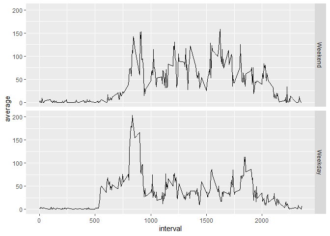

## Loading and preprocessing the data
Setting global option echo=T

```r
knitr::opts_chunk$set(echo=T)
```


Read csv file "activity.csv" from github repo raw link, 
cache=F for storing the read data (avoids rerunning unchanged script):

```r
data1<-read.csv("https://raw.githubusercontent.com/Renkzzz/RepData_PeerAssessment1/master/activity.csv")
```

Change variable "date" class from character to date,
quietly=T means no message confirming package loading is printed:

```r
library(lubridate, quietly = T)
```

```
## 
## Attaching package: 'lubridate'
```

```
## The following objects are masked from 'package:base':
## 
##     date, intersect, setdiff, union
```

```r
data1$date<-ymd(data1$date)
```


## What is mean total number of steps taken per day?

Group steps by date, summarize by steps by date:

```r
library(dplyr, quietly = T)
```

```
## 
## Attaching package: 'dplyr'
```

```
## The following objects are masked from 'package:stats':
## 
##     filter, lag
```

```
## The following objects are masked from 'package:base':
## 
##     intersect, setdiff, setequal, union
```

```r
daily_sum<-data1%>%
  group_by(date)%>%
  summarise(daily_steps=sum(steps,na.rm=TRUE),na=mean(is.na(steps)))
```


```r
library(dplyr, quietly = T)
daily_sum<-filter(daily_sum,na<1)
hist(daily_sum$daily_steps,col="blue",breaks=15,main = "Daily steps total",xlab = "Steps each day")
```

<!-- -->

Mean and median of daily sum steps:

```r
mean(daily_sum$daily_steps)
```

```
## [1] 10766.19
```

```r
median(daily_sum$daily_steps)
```

```
## [1] 10765
```


## What is the average daily activity pattern?
A time series plot (i.e. type = "l") of the 5-minute interval (x-axis) and the average number of steps taken, averaged across all days (y-axis)

```r
library(dplyr,quietly = T)
daily_pattern <- data1 %>% 
  group_by(interval) %>% 
  summarise(average=mean(steps,na.rm=TRUE))

plot(x = 1:nrow(daily_pattern),y = daily_pattern$average,type = "l",
     col = "blue", xaxt = "n",xlab="interval", 
     ylab = "mean interval across days")
axis(1,labels=daily_pattern$interval[seq(1,300,24)],
     at = seq_along(daily_pattern$interval)[seq(1,300,24)])
```

<!-- -->


Which 5-minute interval, on average across all the days in the dataset, contains the maximum number of steps:

```r
library(dplyr,quietly = T)
max_steps<-filter(daily_pattern,average==max(average))

max_steps
```

```
## # A tibble: 1 x 2
##   interval average
##      <int>   <dbl>
## 1      835    206.
```

Count NAs

```r
sum(is.na(data1))
```

```
## [1] 2304
```


## Imputing missing values

Use mice package to apply multiple imputation for filling NAs,
for single mean imputation change "pmm" to "mean":

```r
library(mice, quietly = T)
```

```
## 
## Attaching package: 'mice'
```

```
## The following object is masked from 'package:stats':
## 
##     filter
```

```
## The following objects are masked from 'package:base':
## 
##     cbind, rbind
```

```r
data2 <- mice(data1, m=5, method = "pmm")
```

```
## 
##  iter imp variable
##   1   1  steps
##   1   2  steps
##   1   3  steps
##   1   4  steps
##   1   5  steps
##   2   1  steps
##   2   2  steps
##   2   3  steps
##   2   4  steps
##   2   5  steps
##   3   1  steps
##   3   2  steps
##   3   3  steps
##   3   4  steps
##   3   5  steps
##   4   1  steps
##   4   2  steps
##   4   3  steps
##   4   4  steps
##   4   5  steps
##   5   1  steps
##   5   2  steps
##   5   3  steps
##   5   4  steps
##   5   5  steps
```

```r
summary(data2)
```

```
## Class: mids
## Number of multiple imputations:  5 
## Imputation methods:
##    steps     date interval 
##    "pmm"       ""       "" 
## PredictorMatrix:
##          steps date interval
## steps        0    1        1
## date         1    0        1
## interval     1    1        0
```

```r
methods(mice)
```

```
## Warning in .S3methods(generic.function, class, envir): function 'mice' appears
## not to be S3 generic; found functions that look like S3 methods
```

```
##  [1] mice.impute.2l.bin       mice.impute.2l.lmer      mice.impute.2l.norm     
##  [4] mice.impute.2l.pan       mice.impute.2lonly.mean  mice.impute.2lonly.norm 
##  [7] mice.impute.2lonly.pmm   mice.impute.cart         mice.impute.jomoImpute  
## [10] mice.impute.lda          mice.impute.logreg       mice.impute.logreg.boot 
## [13] mice.impute.mean         mice.impute.midastouch   mice.impute.mnar.logreg 
## [16] mice.impute.mnar.norm    mice.impute.norm         mice.impute.norm.boot   
## [19] mice.impute.norm.nob     mice.impute.norm.predict mice.impute.panImpute   
## [22] mice.impute.passive      mice.impute.pmm          mice.impute.polr        
## [25] mice.impute.polyreg      mice.impute.quadratic    mice.impute.rf          
## [28] mice.impute.ri           mice.impute.sample       mice.mids               
## [31] mice.theme              
## see '?methods' for accessing help and source code
```

```r
data2 <- complete(data2,1)

sapply(data2, function(x) sum(is.na(x))) 
```

```
##    steps     date interval 
##        0        0        0
```


Find daily steps of imputed data 

```r
library(dplyr, quietly = T)
daily_sum2<-data2%>%
  group_by(date)%>%
  summarise(daily_steps=sum(steps,na.rm=F),na=mean(is.na(steps)))
```


Histogram of steps for imputed data,
multiple imputation is used instead of single mean imputation,
since the latter decreases variances in the data:

```r
library(dplyr, quietly = T)

hist(daily_sum2$daily_steps,col="blue",breaks=15,main = "Daily steps total",xlab = "Steps each day")
```

<!-- -->


Mean and median of daily sum steps:

```r
mean(daily_sum2$daily_steps)
```

```
## [1] 10708.48
```

```r
median(daily_sum2$daily_steps)
```

```
## [1] 10600
```


## Are there differences in activity patterns between weekdays and weekends?

Create a new factor variable in the dataset with two levels – “weekday” and “weekend” indicating whether a given date is a weekday or weekend day:

```r
library(lubridate, quietly=T)
library(dplyr, quietly=T)
weekdayYES <-function(date){
        if(wday(date)%in%c(1,7)) output<-"Weekend"
        else
                output<-"Weekday"
        output
}
data2 <- mutate(data2,date=ymd(date)) %>% mutate(day=sapply(date,weekdayYES))
table(data2$day)
```

```
## 
## Weekday Weekend 
##   12960    4608
```


Make a panel plot containing a time series plot (i.e. type = "l") of the 5-minute interval (x-axis) and the average number of steps taken, averaged across all weekday days or weekend days (y-axis):

```r
library(ggplot2)
daily_pattern2 <- data2 %>% mutate(day=factor(day,levels=c("Weekend","Weekday")),
steps=as.numeric(steps)) %>% 
  group_by(interval,day) %>% 
  summarise(average=mean(steps))
```

```
## `summarise()` has grouped output by 'interval'. You can override using the `.groups` argument.
```

```r
qplot(interval,average,data=daily_pattern2,geom="line",facets=day~.)
```

<!-- -->


